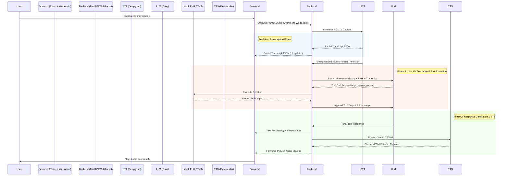
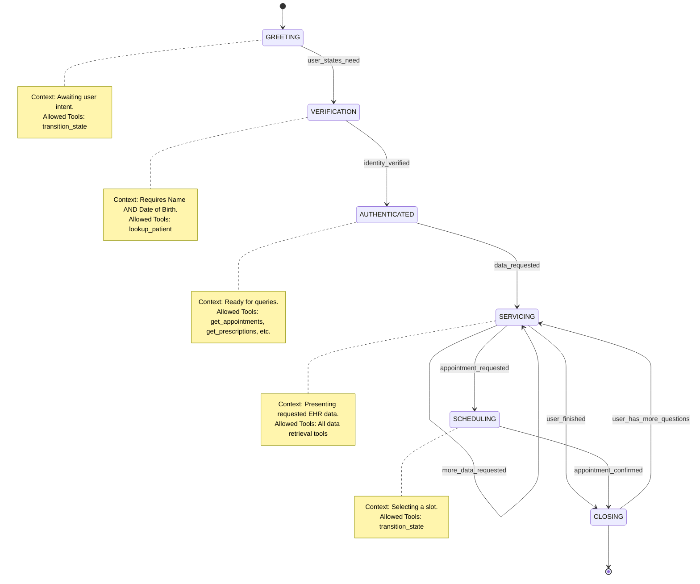

# Medi - Medical Voice Assistant

## Overview
Medi is a real-time, AI-powered voice assistant developed for the Greenfield Medical Group. It integrates low-latency Speech-to-Text (Deepgram), a fast LLM (Groq / Llama-3.1), and Text-to-Speech (ElevenLabs) to provide a seamless conversational interface. Patients can securely look up their appointments, verify prescriptions, retrieve lab results, and schedule new appointments.

## System Architecture

The system leverages a WebSocket-based streaming architecture to minimize audio latency and provide real-time transcriptions. The frontend captures raw PCM audio via the Web Audio API and streams it to the backend, which acts as the central router between the STT, LLM, and TTS services.

## State Machine

To enforce strict conversational flows, minimize hallucinations, and restrict tool access, the backend utilizes a State Machine. The LLM's system prompt and its available tools are dynamically updated depending on the active state.

## Security & Guardrails

- **Pre-LLM Safety Classifier:** A deterministic regex-based classifier intercepts emergency keywords (e.g., "heart attack", "suicide"). If triggered, the system immediately bypasses the LLM and streams an emergency redirect response.
- **Post-LLM Response Validation:** The orchestrator cross-references the LLM's generated response against the actual tool outputs. If the LLM hallucinates sensitive clinical data (such as a medication or lab test not returned by the database), the response is overridden with a generic fallback.
- **State-based Authorization:** Data retrieval tools (`get_appointments`, `get_prescriptions`, `get_labs`) are strictly blocked at the dispatcher level (`tools.py`) unless a valid `verified_patient_id` has been set in the session state.

## Known Issues & Limitations

- **Latency & Tool Thrashing:** The system can experience slow response times because the LLM occasionally makes redundant or excessive tool calls (such as transitioning states multiple times unnecessarily) before arriving at a final text response.
- **Data Leakage during Verification:** The LLM sometimes leaks PII prematurely. For example, if the user only provides a name (e.g., "James Wilson"), the LLM may hallucinate or infer the date of birth from its training data/context without explicitly asking the user to provide it.

## Key Components

### Backend (`/backend/app/api`)
- `orchestrator.py`: Manages the LLM conversation loop, malformed JSON recovery, hallucinatory XML tag parsing, and filler phrase dispatching.
- `websocket.py`: Main FastAPI entry point handling the concurrent binary streams between the frontend, Deepgram, and ElevenLabs.
- `prompts.py`: Dynamic prompt generation based on the active state machine phase.
- `tools.py`: Function definitions and dispatcher for the mock EHR database.
- `guardrails.py`: Fast pre-processing and post-processing safety checks.

### Frontend (`/app`)
- `hooks/useVoiceSession.ts`: React hook managing the Web Audio API, VAD (Voice Activity Detection), and WebSocket connection.
- `lib/audioManager.ts`: Handles PCM chunk scheduling for gapless audio playback and immediate interruptions.
- `components/`: UI components for the chat panel and real-time waveform visualizer.